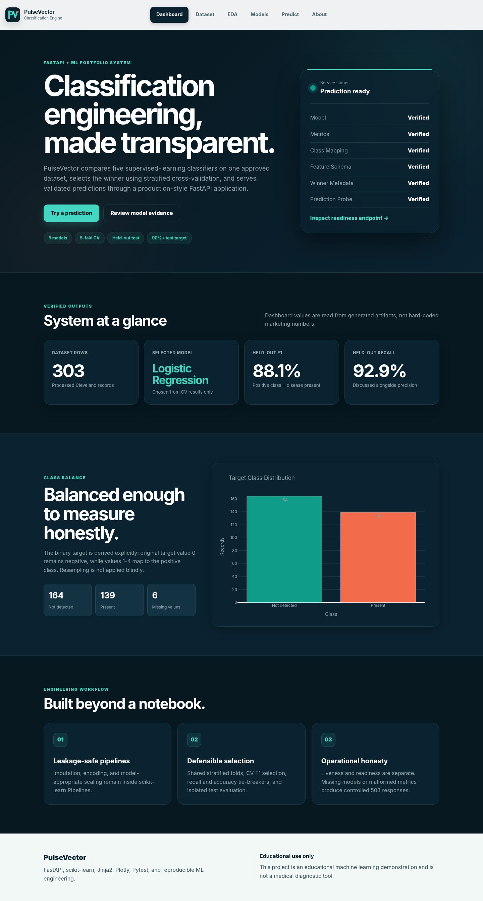
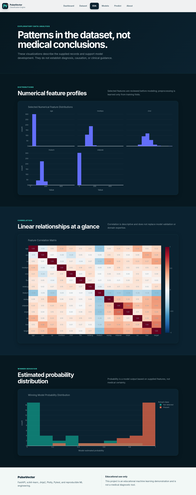
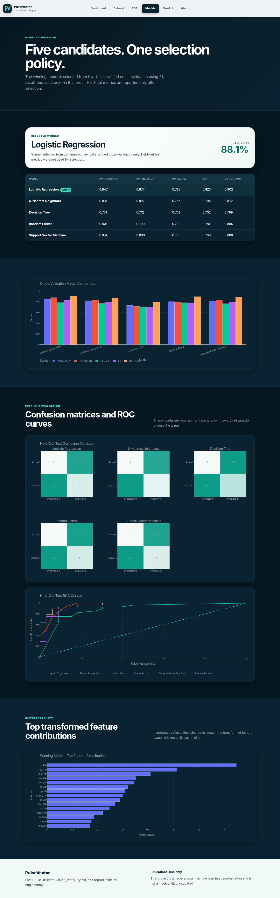
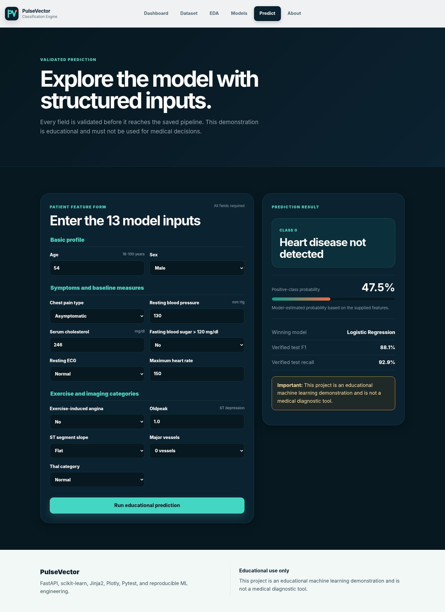

  

<h1 align="center">PulseVector</h1>

  <strong>FastAPI & ML-Powered Heart Disease Classification Engine</strong>

  A reproducible binary-classification platform that compares five machine-learning pipelines, selects the winner using training-only cross-validation, independently verifies held-out metrics and serves validated predictions through FastAPI and Jinja2.

  
  
  
  
  
  

> **Educational disclaimer:** PulseVector is an educational machine-learning demonstration and is not a medical diagnostic tool. It must not be used for diagnosis, treatment, clinical decision-making or emergency guidance.

---

## Screenshots

### Dashboard — Project Overview

### Exploratory Data Analysis — Heart Disease Insights

### Model Performance — Classification Algorithm Comparison

### Live Prediction Result — Heart Disease Classification

Additional screens are available in the [`screenshots/`](screenshots/) directory:

- Dataset audit
- Prediction form
- About and methodology

---

## Project Overview

PulseVector transforms a supervised binary-classification model into a complete, reproducible machine-learning system. The project covers dataset inspection, leakage-safe preprocessing, five-model comparison, cross-validation-based winner selection, held-out evaluation, artifact verification, FastAPI serving, automated testing, CI configuration, responsive UI and deployment readiness.

One approved dataset, one target mapping, one stratified train/test split, and the same materialized five-fold `StratifiedKFold` splits are used across all candidate models.

### Selection Policy

1. Highest mean cross-validation F1-score
2. Recall as the first tie-breaker
3. Accuracy as the second tie-breaker

The held-out test set is never used to select the winning model.

### Selected Model

| Item | Result |
|---|---:|
| Winning model | **Logistic Regression** |
| Mean CV F1-score | **0.825** |
| Held-out accuracy | **0.885** |
| Held-out precision | **0.839** |
| Held-out recall | **0.929** |
| Held-out F1-score | **0.881** |
| Held-out specificity | **0.848** |
| Held-out ROC-AUC | **0.966** |

---

## Main Features

- Five classification algorithms in one reproducible project
- Leakage-safe, model-specific scikit-learn pipelines
- Shared stratified cross-validation folds for every candidate
- CV-only winner selection with held-out test-set isolation
- Independently verifiable saved test predictions
- Saved candidate pipelines and `best_model.joblib`
- Accuracy, precision, recall, F1, specificity, ROC-AUC and confusion matrices
- Interactive Plotly EDA and model-evaluation reports
- FastAPI JSON and HTML prediction endpoints
- Strict Pydantic validation with unknown-field rejection
- Controlled `422`, `503`, and sanitized `500` behavior
- Honest `/health` and end-to-end `/ready` checks
- Responsive Jinja2 interface with accessible navigation
- Screen-reader chart summaries and reduced-motion support
- 71 meaningful automated tests
- 95.98% verified app and ML coverage
- GitHub Actions CI and Render Blueprint configuration

---

## Tech Stack

| Layer | Technologies |
|---|---|
| Language | Python 3.13 |
| Backend | FastAPI, Uvicorn, Pydantic |
| Frontend | Jinja2, HTML5, CSS3, vanilla JavaScript |
| Machine Learning | pandas, NumPy, scikit-learn, joblib |
| Visualization | Plotly |
| Testing | Pytest, pytest-cov, HTTPX |
| CI | GitHub Actions |
| Deployment | Render Blueprint |
| Documentation | Markdown, DOCX, PDF |

---

## Model Results

The following table reports held-out test performance for transparency. These values were **not** used to select the winner.

| Model | Accuracy | Precision | Recall | F1-Score | ROC-AUC |
|---|---:|---:|---:|---:|---:|
| **Logistic Regression** | **0.885** | **0.839** | **0.929** | **0.881** | **0.966** |
| K-Nearest Neighbors | 0.902 | 0.867 | 0.929 | 0.897 | 0.960 |
| Decision Tree | 0.787 | 0.727 | 0.857 | 0.787 | 0.879 |
| Random Forest | 0.902 | 0.844 | 0.964 | 0.900 | 0.950 |
| Support Vector Machine | 0.885 | 0.839 | 0.929 | 0.881 | 0.964 |

Logistic Regression remained the selected model because it achieved the highest mean cross-validation F1-score. Some candidates performed better on this particular 61-row held-out sample, but using test results to change the winner would violate the documented test-set isolation policy.

---

## Dataset & Attribution

| Property | Details |
|---|---|
| Dataset | Heart Disease — Processed Cleveland |
| Original source | UCI Machine Learning Repository |
| Local file | `data/raw/heart_disease_cleveland.csv` |
| Rows | 303 |
| Input features | 13 |
| Original target | `num`, values 0–4 |
| Binary class 0 | Heart disease not detected |
| Binary class 1 | Heart disease present |
| Missing values | 6 total — `ca`: 4, `thal`: 2 |
| Duplicate rows | 0 |
| Dataset license | CC BY 4.0 |

The MIT License in this repository applies only to the project code. Dataset use remains subject to the UCI source attribution and CC BY 4.0 terms.

---

## Project Scope

PulseVector demonstrates the engineering lifecycle around a classification model:

- Dataset validation
- Reproducible preprocessing
- Model comparison
- Leakage prevention
- Cross-validation-based model selection
- Held-out evaluation
- Artifact serialization and verification
- Prediction serving
- Failure handling
- Automated testing
- CI configuration
- Deployment readiness
- Responsive portfolio presentation

The project is educational and has not been clinically validated.

---

## Future Improvements

- External validation on an independently approved dataset
- Probability-calibration analysis without test leakage
- Carefully documented model-explainability views
- Drift monitoring for input schema and distributions
- Containerized deployment where required
- Production observability and structured logging
- Real-world validation under an appropriate clinical and regulatory framework

---

## License

Project code is released under the [MIT License](LICENSE).

The UCI Heart Disease dataset remains subject to its original attribution and CC BY 4.0 terms.
